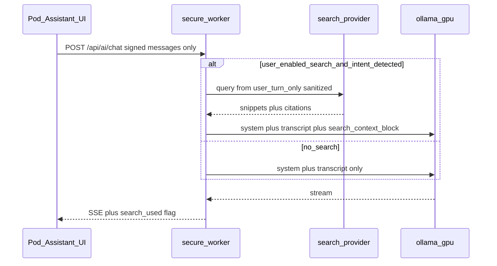

# Civic AI Kami — web search (deferred design)

**Status:** Not implemented. Kami today has **no web search, RAG, or news API**.

This document records a **bounded** design if the cooperative later adds retrieval for
current events — without weakening the Pod security model or the SQL-only faithful
aggregate reporting path (`civic-analysis.js`).

## Goals

- Allow optional, user-visible lookup for **public** facts (news, dates, official pages).
- **Never** attach Pod SQL, forum submissions, journal, behaviors, or traits to search queries.
- Keep Kami separate from cooperative D1 aggregate reports (no generative narrative there).

## Non-goals

- Replacing Explore for “what did I submit?”
- Hidden RAG over `PersonalPodDO` tables (removed in v2.0 after hallucinations).
- Sending unlock tokens, signing keys, or full chat history to a search vendor.

## Proposed architecture

## Hard boundaries (Pack 3)

| Rule | Rationale |
|------|-----------|
| Search query = **current user message only** (max length cap, strip PII patterns) | Prevents Pod context leakage |
| No `podContext`, no Explore exports, no D1 rows in search | Scope creep / surveillance risk |
| Search **off by default**; Settings toggle + per-send indicator | Pack 4 corrigibility |
| Sanitize snippets before model (strip HTML/scripts, max chars per snippet, max snippets) | Prompt injection via untrusted pages |
| Worker returns `search_used: true` and provider name in SSE metadata | User-visible transparency |
| Rate limit search per `credential_id` per day in D1 | Cost and abuse control |
| Do not log search queries or snippets to D1 | Same privacy bar as chat text |

## API sketch (future)

| Piece | Note |
|-------|------|
| `POST /api/ai/chat` | Optional `allow_search: boolean` in signed payload; Worker ignores client `system` messages (unchanged). |
| Env | `KAMI_SEARCH_ENABLED=0`, `KAMI_SEARCH_PROVIDER_URL`, `KAMI_SEARCH_API_SECRET` (Wrangler secret). |
| UI | Badge: “This reply used web search.” Link to cooperative search policy. |

## Risks if implemented poorly

- **Third-party trust** — Queries leave the cooperative to a search API.
- **Prompt injection** — Adversarial pages in results can steer the model; mitigated by snippet caps + system prompt red-lines (already in `civic-ai-system-prompt.js`).
- **False authority** — Model may treat snippets as fact; UI must say snippets are unverified retrieval, not cooperative SQL truth.

## When to revisit

Only after operator runbook for Ollama logging is in place ([kami-ollama-ops.md](kami-ollama-ops.md))
and product owners accept third-party egress. Until then, disclose in Pod UI that the model
has a training cutoff and no live retrieval.
