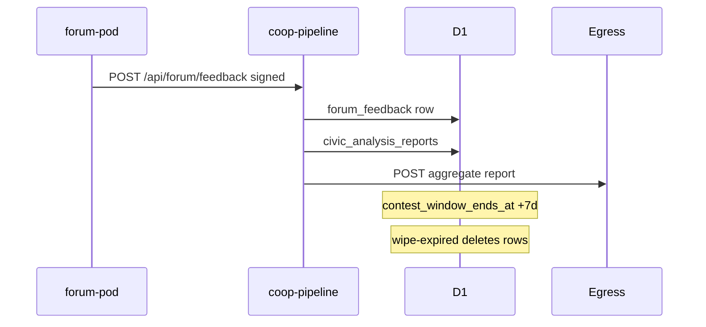

# Architecture & Data Flow

## Monorepo layout (`forum-stack`)

| Path | Worker / hostname | Role |
|------|-------------------|------|
| `forum-pod-airlock/` | `airlock.yourcommunity.forum`, `pod.yourcommunity.forum` | Personal Pod UI + `PersonalPodDO` + Civic AI |
| `forum-airlock/` | `coop.yourcommunity.forum` | Cooperative pipeline (`coop-pipeline`) |
| `forum-egress/` | egress worker | Public aggregate reports (KV) |
| `forum-pod/` | (built into pod-airlock `dist/`) | Shared PWA / Capacitor source |

## Cooperative feedback (opt-in only)

Pods **initiate** all connections to the co-op. The co-op never opens inbound connections to a member's self-hosted pod.

## Signed request flow (co-op ingest)

1. Client creates or unlocks a local signing key (WebAuthn on DO-hosted pods, or `local-*` Ed25519 on airlock local-first).
2. Client `signBundle` → `POST coop…/api/forum/feedback`.
3. Co-op: session binding → unlock verify (or local-credential bypass) → signature verify → D1 insert.

## Public vs private

| Surface | Public? |
|---------|---------|
| `GET forum-egress` | Yes — published aggregate report |
| `GET /api/civic/analysis` | Yes — published aggregate snapshot |
| `POST /api/forum/feedback` | No — signed |
| `/api/pod/*` | No — on `forum-pod-airlock` worker |
| `/api/ai/chat` | No — on `forum-pod-airlock` worker |
