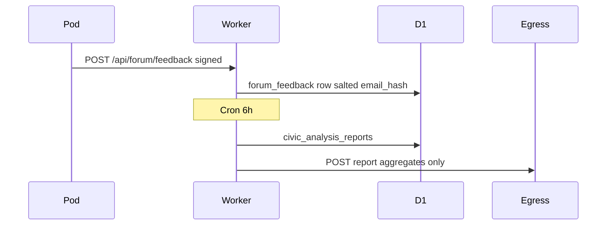

# Architecture & Data Flow

## Components

| Component | Role |
|-----------|------|
| `forum-pod` | PWA / Capacitor client; WebAuthn + Ed25519 signing |
| `secure-worker` | Edge API, D1 ingest, DO router, civic analysis |
| `PersonalPodDO` | Per-user SQLite state (journal, assistant, traits) |
| `forum-egress` | Public HTML/JSON reports (KV `latest`) |
| `listener` | Optional on-prem encrypted receipt mirror |

## Signed request flow

1. Client unlocks with WebAuthn → receives `unlockToken` (`jti`, 5 min TTL).
2. Client builds payload → `signBundle` (Ed25519, non-extractable key in memory).
3. Client attaches `deviceCredentialId`, `unlockToken`, `signature`.
4. Worker: session binding → unlock verify (+ jti) → signature verify → replay cache → handler.

## Cooperative feedback

## Encryption & signing

| Layer | Mechanism |
|-------|-----------|
| Transport | HTTPS / HSTS |
| Device signing | Ed25519 non-extractable Web Crypto |
| Unlock | HMAC-SHA256 + D1 jti |
| Local cache | AES-GCM via WebAuthn PRF (when available) |
| Receipt mirror | Fernet via listener (optional) |

## Public vs private

| Surface | Public? |
|---------|---------|
| `GET /api/civic/analysis` | Yes — latest report (aggregates) |
| `GET /api/civic/analysis/ledger` | Yes — no verbatim comments in beta |
| `GET forum-egress` | Yes — HTML report |
| `/api/pod/*` | No — signed + unlocked |
| `/api/ai/chat` | No — signed + unlocked + quota |
