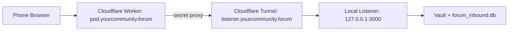

# Forum Personal Pod

Local-first civic pod with IndexedDB, DuckDB Local SQL, **Solid Pod** storage, **WebAuthn** device gate, and **opt-in** cooperative export (signed bundles).

For Android APK packaging, see `README-ANDROID-APP.md`. For Solid/CSS operations, see `README-SOLID-MIGRATION.md` and `forum-pod/docs/`.

## What Runs Where

- `forum-pod`: browser/PWA personal pod. It stores civic submissions in IndexedDB, hydrates DuckDB from that storage on startup, and lets the AI agent query local rows.
- `forum-airlock`: cooperative API listener. It receives synced submissions and writes an encrypted ledger entry.
- `forum-ai`: local analysis pipeline. It decrypts with `FERNET_KEY`, classifies through Ollama, aggregates, and optionally pushes to egress.
- `forum-egress`: Cloudflare Worker receiver for aggregate reports.

## Server Setup

1. Create local config:

   ```bash
   cp ~/Desktop/forum.config.env.example ~/Desktop/forum.config.env
   ```

2. Fill in:

   - `AIRLOCK_SECRET`: shared secret between the pod proxy and listener.
   - `FERNET_KEY`: Fernet key for encrypted at-rest rows. Do not reuse `AIRLOCK_SECRET`.
   - `FORUM_EGRESS_URL` and `FORUM_SECRET`: optional cloud report egress.

3. Install services and build the PWA:

   ```bash
   ~/Desktop/deploy/install-forum-server.sh
   ```

4. Check services:

   ```bash
   systemctl --user status forum-airlock-listener.service
   systemctl --user list-timers forum-analysis.timer
   journalctl --user -u forum-airlock-listener.service -f
   ```

5. If the server should keep running after logout:

   ```bash
   sudo loginctl enable-linger "$USER"
   ```

## Pod Development

```bash
cd ~/Desktop/forum-pod
npm run dev
```

The dev server reads `~/Desktop/forum.config.env`, proxies `/api/civic/submit` to the listener, and proxies `/api/ollama` to local Ollama.

## PWA Build

```bash
cd ~/Desktop/forum-airlock
npm run build:pod
```

The compiled installable pod is copied into `forum-airlock/dist` and served by the airlock worker.

## Phone Access

Phones need the pod to be served over HTTPS. The recommended setup is:



Use two public hostnames:

- `pod.yourcommunity.forum`: Cloudflare Worker serving the PWA from `forum-airlock/dist`.
- `listener.yourcommunity.forum`: Cloudflare Tunnel to `http://127.0.0.1:3000`.

Setup outline:

```bash
# One-time Cloudflare auth and tunnel creation
cloudflared tunnel login
cloudflared tunnel create forum-airlock
cloudflared tunnel route dns forum-airlock listener.yourcommunity.forum

# Copy/edit the generated tunnel id and credentials path
cp ~/Desktop/deploy/cloudflared-forum.yml.example ~/.cloudflared/forum-airlock.yml
nano ~/.cloudflared/forum-airlock.yml

# Install the tunnel as a user service
bash ~/Desktop/deploy/install-phone-access.sh

# Deploy the Worker/PWA
cd ~/Desktop/forum-airlock
npx wrangler secret put AIRLOCK_SECRET
npm run build:pod
npm run deploy:worker
```

In `forum-airlock/wrangler.toml`, set:

```toml
AIRLOCK_URL = "https://pod.yourcommunity.forum"
LISTENER_URL = "https://listener.yourcommunity.forum"
```

Then open `https://pod.yourcommunity.forum/pod` on your phone and use the browser’s `Add to Home Screen` / `Install App` action.

Note: the deployed phone PWA loads DuckDB runtime bundles from jsDelivr. This keeps the Worker asset upload under Cloudflare’s 25 MiB per-file limit while keeping civic submissions durable in local IndexedDB.

## Refresh And Offline Behavior

- Civic submissions are saved first to browser IndexedDB.
- On startup, rows are loaded back into DuckDB as `civic_submissions` and `civic_categories`.
- If sync fails, the row stays local with `egress_status = failed`.
- The pod retries queued rows on startup, when the browser comes back online, or when the user clicks `Retry saved submissions`.

## Verify Persistence

1. Open the pod.
2. Submit civic feedback.
3. Refresh the browser.
4. Ask the AI agent: `tell me about my latest submission`.
5. The answer should come from `civic_submissions` without needing the SQL editor.

You can also run:

```sql
SELECT receipt_id, zip_code, category_label, comment, egress_status, vault_status, submitted_at
FROM civic_submissions
ORDER BY submitted_at DESC;
```

## Reset Local Pod Data

In the browser DevTools console:

```js
indexedDB.deleteDatabase("forum-personal-pod")
```

Then refresh the pod.

## Important Notes

- Browser data is local to that browser profile and device.
- `forum_inbound.db` is the cooperative encrypted server-side ledger, not the user's local pod history.
- A browser/PWA pod is the first downloadable shape. A desktop app can later wrap the same storage/sync model for stronger local filesystem durability.
