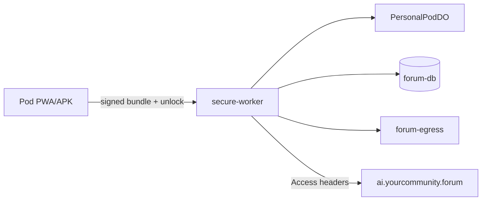

# Forum-Stack Threat Model (POC / Public Beta)

## Assets

- Ed25519 device signing keys (client memory, non-extractable Web Crypto)
- WebAuthn passkeys + 5-minute unlock tokens (HMAC + per-RPC `jti` in D1)
- Personal Pod data (Durable Objects per `sessionId`)
- Cooperative feedback (D1 `forum_feedback`, salted `email_hash`)
- Published aggregate reports (forum-egress KV)

## Trust boundaries

## Mitigations (implemented)

| Threat | Control |
|--------|---------|
| Pilot bypass | `ALLOW_PILOT_BUNDLES=0` |
| Unauthenticated publish | `/dev-push` removed; `/run` requires `X-Airlock-Secret` |
| Open AI tunnel | `AI_ACCESS_*` required; upstream hostname Access-protected |
| Key extraction | Ed25519 `extractable: false`; no `privateJwk` in `localStorage` |
| Unlock token replay | `jti` + `signature` hash in D1; 5 min TTL |
| Bundle replay | `edge_replay_cache` |
| Forensic local cache | Session PRF AES-GCM; idle lock; background wipe |
| Public comment leak | `CIVIC_PUBLISH_VERBATIM_COMMENTS=0` |
| Cross-cycle linkability | Rotating `member_hash_salt` per cron cycle |
| DO spam | 256 KiB body cap; 60 writes/min per session |

## Residual risks

- Insider with D1 access can correlate rows within a salt cycle.
- Non-extractable keys are lost on reload until recovery passkey ships (`docs/ANDROID-KEYSTORE.md`).
- ZK / blind signatures deferred post-POC.

## Audit log

- 2026-05-26: Adversarial repo audit; Phase 0–1 remediations in `main`.
